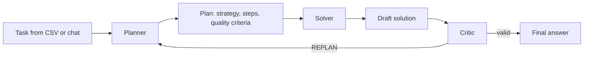

# Meta-Prompt Planning Agent

Учебно-исследовательский проект про LLM-агента, который сначала строит план решения задачи, затем решает ее по этому плану и проверяет результат через отдельную роль критика.

Проект сделан как курсовая работа и как портфолио-проект для NLP / LLM / ML стажировок: в нем есть агентная архитектура, prompt templates, CSV-датасет, воспроизводимый CLI-запуск, офлайн-режим без API-ключей и интеграция с YandexGPT.

## Research Question

Может ли явный этап meta-planning улучшить качество решений для сложных многошаговых задач по сравнению с прямым ответом базовой LLM?

## Architecture



Роли разделены намеренно:

- `Planner` выбирает стратегию, шаги, критерии качества и условия перепланирования.
- `Solver` решает задачу по готовому плану, не меняя стратегию.
- `Critic` проверяет полноту, согласованность и соответствие плану.
- `Agent` оркестрирует цикл `Planner -> Solver -> Critic` с ограничением на число перепланирований.

## Features

- Локальный `stub`-режим для воспроизводимой отладки без внешнего API.
- `yandex`-режим для запуска через YandexGPT API.
- CLI для одиночной задачи, пакетного прогона датасета и интерактивного режима.
- Отдельные prompt templates в Markdown.
- CSV-датасет из 20 задач разной сложности.
- JSON-логи одиночных запусков и CSV-результаты пакетных экспериментов.

## Quick Start

```bash
cd meta_planning_agent
python -m venv .venv
source .venv/bin/activate
pip install -r requirements.txt
cp .env.example .env
python main.py single --task-id q03
```

По умолчанию используется `LLM_PROVIDER=stub`, поэтому проект запускается без API-ключей.

## Run Modes

```bash
# Run the first task from data/tasks.csv.
python main.py single

# Run a selected task.
python main.py single --task-id q03

# Run the whole dataset and save results to results/.
python main.py dataset

# Interactive mode.
python main.py chat
```

## YandexGPT Setup

В `.env` нужно переключить провайдера и добавить ключи:

```env
LLM_PROVIDER=yandex
YANDEX_API_KEY=your_api_key
YANDEX_FOLDER_ID=your_folder_id
MODEL_NAME=yandexgpt-lite/latest
```

Если нужен конкретный model URI, можно задать `YANDEX_MODEL_URI` явно.

## Repository Structure

```text
.
├── README.md
├── plan ver 2.md
└── meta_planning_agent/
    ├── app/
    ├── data/
    ├── logs/
    ├── notebooks/
    ├── prompts/
    ├── .env.example
    ├── main.py
    └── requirements.txt
```

## Current Limitations

- `stub`-режим предназначен для проверки пайплайна, а не для оценки качества LLM.
- Автоматическая оценка качества ответов пока не реализована.
- Baseline-сравнение с прямым вызовом модели вынесено в следующий этап.
- Критик использует текстовый сигнал `REPLAN`, поэтому формат ответа модели важен.

## Next Steps

- Добавить baseline `direct_llm` для сравнения с meta-planning пайплайном.
- Добавить простую разметку качества ответов и ноутбук с анализом результатов.
- Сохранить сырые ответы Planner / Solver / Critic в едином экспериментальном формате.
- Добавить unit-тесты для парсинга планов и CLI-команд.

## Portfolio Summary

`Meta-Prompt Planning Agent` is a Python LLM-agent MVP with Planner, Solver and Critic roles, YandexGPT integration, offline stub mode, a CSV evaluation dataset and reproducible CLI experiments.
